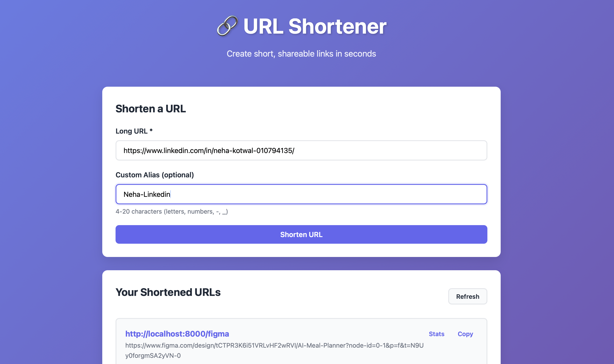

# 🌐 URL Shortener Service

A **clean, modern, and production-ready** URL shortener built with **Python** and **FastAPI** — featuring a responsive web UI, analytics, caching, and rate limiting.

---
## 📖 Table of Contents
0. [🖼️ Preview](#-preview)  
1. [✨ Features](#-features)  
2. [🚀 Quick Start](#-quick-start)  
3. [🖥️ Web Interface](#️-web-interface)  
4. [🧩 Tech Stack](#-tech-stack)  
5. [⚙️ Example Usage](#️-example-usage)
6. [🔗 API Endpoints](#-api-endpoints)    
7. [🧱 Configuration](#-configuration)  
8. [🧪 Testing](#-testing)  
9. [⚡ How It Works](#-how-it-works)  
10. [🧠 Performance Features](#-performance-features)
11. [👩 Author](#-author)

---

## 🖼️ Preview


---

## ✨ Features

- 🖥️ **Modern Web UI** – Create, manage, and track short URLs in a sleek interface  
- 🔗 **Base62 Shortening** – Compact, readable short codes  
- 🧭 **Custom Aliases** – Personalized short links (e.g., `/mylink`)  
- 📊 **Click Analytics** – Real-time tracking with timestamps and counts  
- ⚡ **LRU Caching** – In-memory cache for hot URLs with TTL support  
- 🚦 **Rate Limiting** – Token bucket algorithm per IP  
- ⏰ **URL Expiration** – Time-limited links  
- 🧠 **RESTful API** – Fully documented with Swagger & ReDoc  
- 💾 **SQLite / PostgreSQL** – Flexible database backend  

---

## 🚀 Quick Start

```bash
# 1️⃣ Clone and navigate to the project
git clone https://github.com/NehaKotwal/UrlShortner.git
cd UrlShortner

# 2️⃣ Create virtual environment
python -m venv venv
source venv/bin/activate  # On Windows: venv\Scripts\activate

# 3️⃣ Install dependencies
pip install -r requirements.txt

# 4️⃣ Initialize database
python scripts/init_db.py

# 5️⃣ Run the application
uvicorn src.main:app --reload

# 6️⃣ Open your browser
http://localhost:8000
```

## 🖥️ Web Interface

Once the application is running, open your browser and visit **http://localhost:8000**. You'll see a modern web interface where you can:

1. **Shorten URLs** - Enter a long URL and optionally a custom alias
2. **View Your Links** - See all shortened URLs with click counts
3. **Track Analytics** - Click "Stats" to view detailed statistics for each URL
4. **Copy Links** - One-click copy to clipboard functionality

The UI is fully responsive and works great on mobile devices too!

## 🧩 Tech Stack

- **Python 3.10+** - Programming language
- **FastAPI** - Modern async web framework
- **SQLAlchemy** - Database ORM
- **SQLite** - Database (upgradeable to PostgreSQL)
- **Uvicorn** - ASGI server
- **HTML/CSS/JS** - Modern web UI with vanilla JavaScript

## ⚙️ Example Usage

### Core Endpoints

- `GET /` - Web UI home page
- `POST /api/shorten` - Create a shortened URL
- `GET /{short_code}` - Redirect to original URL
- `GET /api/urls` - List all URLs (with pagination)
- `GET /api/urls/{short_code}/stats` - Get URL statistics
- `GET /health` - Health check endpoint

### API Documentation

Once running, visit these URLs for interactive API documentation:

- **Swagger UI**: http://localhost:8000/docs
- **ReDoc**: http://localhost:8000/redoc

## 🔗 API Endpoints

### Shorten a URL

```bash
curl -X POST "http://localhost:8000/api/shorten" \
  -H "Content-Type: application/json" \
  -d '{"original_url": "https://www.example.com"}'
```

Response:
```json
{
  "short_code": "aB3xY9",
  "short_url": "http://localhost:8000/aB3xY9",
  "original_url": "https://www.example.com",
  "custom_alias": null,
  "created_at": "2024-01-01T12:00:00"
}
```

### Create Custom Alias

```bash
curl -X POST "http://localhost:8000/api/shorten" \
  -H "Content-Type: application/json" \
  -d '{"original_url": "https://www.example.com", "custom_alias": "my-link"}'
```

### Get URL Statistics

```bash
curl "http://localhost:8000/api/urls/aB3xY9/stats"
```

Response:
```json
{
  "short_code": "aB3xY9",
  "original_url": "https://www.example.com",
  "click_count": 42,
  "created_at": "2024-01-01T12:00:00",
  "last_accessed_at": "2024-01-15T10:30:00"
}
```

### List All URLs

```bash
curl "http://localhost:8000/api/urls?limit=10&offset=0"
```

## 🧱 Configuration

Configuration is managed via environment variables. Copy `.env.example` to `.env` and customize:

```bash
# Application Settings
BASE_URL=http://localhost:8000
SHORT_CODE_LENGTH=6

# Database
DATABASE_URL=sqlite:///./urls.db

# Cache Settings
CACHE_ENABLED=True
CACHE_TTL=3600
CACHE_MAX_SIZE=1000

# Rate Limiting
RATE_LIMIT_ENABLED=True
RATE_LIMIT_REQUESTS=10
RATE_LIMIT_WINDOW=60
```

## 🧪 Testing

Run the test suite:

```bash
# Run all tests
pytest

# Run with coverage report
pytest --cov=src --cov-report=html

# Run specific test file
pytest tests/test_api.py
```

## ⚡ How It Works

1. **URL Shortening**: When you submit a URL, it's validated and stored in the database with a unique Base62-encoded short code
2. **Custom Aliases**: Optionally provide a custom alias (4-20 characters) for personalized links
3. **Redirection**: When someone visits the short URL, they're redirected to the original URL
4. **Analytics**: Each redirect increments a counter and updates the last accessed timestamp
5. **Caching**: Popular URLs (>10 clicks) are cached for faster lookups
6. **Rate Limiting**: Token bucket algorithm prevents abuse (default: 10 requests/minute per IP)

## 🧠 Performance Features

- **LRU Cache**: URLs with more than 10 clicks are automatically cached
- **Database Indexes**: Optimized indexes on `short_code` and `custom_alias`
- **Rate Limiting**: Per-IP rate limiting with token bucket algorithm
- **Connection Pooling**: Efficient database connection management

## 👩 Author

**Neha Kotwal** 

Master's in Computer Science @ University of Washington
[GitHub](https://github.com/NehaKotwal) | [LinkedIn](https://www.linkedin.com/in/neha-kotwal-010794135/)

---

Made with ❤️ by Neha Kotwal
